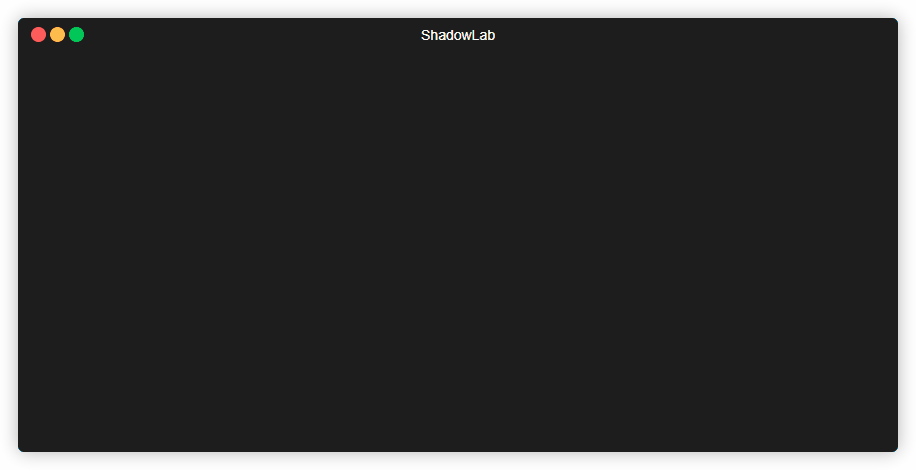

# ShadowLab


> Python-based C2 Framework - Security Research Project

---

## ⚠️ Important Disclaimer

**THIS PROJECT IS FOR EDUCATIONAL AND AUTHORIZED SECURITY RESEARCH PURPOSES ONLY.**

This software is designed to help cybersecurity professionals, researchers, and students understand:
- Client-server architecture and network protocols
- Encryption and secure communication
- System-level programming concepts
- Red team operations and adversary emulation

**Usage Restrictions:**
- Only use on systems you own or have explicit written authorization to test
- Unauthorized access to computer systems is illegal and may result in criminal prosecution
- The author assumes no liability for any misuse or damage caused by this tool

By using this project, you agree to use it responsibly and ethically.

---

## 📋 Overview



Shadow is a security research project that demonstrates how Command & Control (C2) frameworks operate. It provides hands-on experience with:

- Socket programming and network communication
- Cryptographic protocols
- Windows system integration
- Agent/implant development concepts
- Red team tooling architecture

This project is ideal for:
- Cybersecurity students learning about C2 infrastructure
- Security researchers studying attack methodologies
- Red team professionals practicing adversary emulation
- Defenders understanding threats to build better defenses

---

## 🚀 Features

| Feature | Description |
|---------|-------------|
| **Reverse TCP** | Client-initiated connection architecture |
| **Remote Shell** | Remote command execution via secure channel |
| **Microphone Recording** | Audio capture using sounddevice library |
| **Webcam Capture** | Camera access using OpenCV |
| **File Transfer** | Bidirectional file operations |
| **Geolocation** | IP-based geolocation lookup |
| **Persistence** | Windows registry-based persistence mechanisms |
| **Keystroke Monitoring** | *(Coming soon)* Keyboard input monitoring |
| **Connection Info** | Display client IP address and port |

---

## 📁 Project Structure

```
Shadow/
├── Shadow.py           # Main C2 server
├── mainclass/          # Core modules
│   ├── builder.py      # Agent builder
│   ├── encrypter.py    # Encryption utilities
│   ├── options.py      # Configuration options
│   ├── shell.py        # Command handlers
│   └── system.py       # System utilities
├── payloads/           # Agent/implant scripts
├── postexploits/       # Post-exploitation modules (future)
│   └── keystroke.py    # (In development - Pending security implementation)
├── confs/              # Configuration files
│   └── conf.json       # Auth & settings
└── requirements.txt    # Python dependencies
```

---

## 📦 Installation

### 1. Clone the repository
```bash
git clone https://github.com/msalihberk/ShadowLab.git
cd Shadow
```

### 2. Install dependencies
```bash
pip install -r requirements.txt
```

---

## 💻 Usage

### Step 1: Generate Auth Code
Run the main menu and generate an authentication code from the options menu.

### Step 2: Start the C2 Server
```bash
python Shadow.py
```

### Step 3: Configure Connection
- Select option `3` to set your IP address
- Select option `4` to set the listening port

### Step 4: Build Agent
- Choose option `1` to build an agent
- Select format (Python or EXE)
- Optionally bind to another application

### Step 5: Start Listener
- Choose option `2` to start listening
- Wait for incoming agent connection

### Step 6: Manage Session
Once connected, use these commands:

| Command | Action |
|---------|--------|
| `1` | Remote Shell |
| `2` | Create Persistence |
| `3` | Record Microphone |
| `4` | Upload File |
| `5` | Webcam Snapshot |
| `6` | Get Location |
| `7` | Remove Persistence |
| `8` | Connection Info |
| `q` | Quit |

---

## 🔧 Requirements

- **Python 3.x**
- colorama
- cryptography
- nuitka
- opencv-python
- requests
- sounddevice
- wavio
- pillow
- pynput

---

## 📝 License

This project is provided for educational and research purposes only. See [LICENSE](LICENSE) for details.


