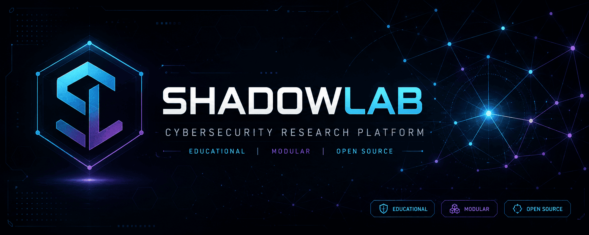

<div align="center">



# ShadowLab

### Modern Educational Command & Control Framework for Cybersecurity Research

*Learn how modern C2 infrastructures are engineered — safely, ethically, and from the inside out.*

<br>

<p>

[Overview](#-overview) •
[Features](#-features) •
[Installation](#-installation) •
[Usage](#-usage) •
[Documentation](#-documentation) •
[Roadmap](ROADMAP.md)

</p>

<br>

[](https://github.com/msalihberk/ShadowLab/stargazers)
[](https://github.com/msalihberk/ShadowLab/network/members)
[](https://python.org)
[]()
[](LICENSE)
[]()

<br><br>

**🔐 Encrypted Communications** •
**📦 Payload Builder** •
**🧩 Modular Post-Exploitation** •
**⚡ Runtime Module Loading** •
**🎓 Educational Research**

</div>

---

> [!IMPORTANT]
>
> **ShadowLab is an educational Command & Control (C2) framework designed exclusively for cybersecurity research, authorized security assessments, and isolated laboratory environments.**
>
> Rather than serving as an offensive toolkit, the project demonstrates how modern C2 infrastructures are engineered through transparent implementations of encrypted communications, payload generation, Windows internals, and modular post-exploitation workflows.
>
> **ShadowLab must never be used against systems without explicit authorization.**

# 🚀 Overview

> [!NOTE]
> Active development is continuing in the [refactor/async-api-architecture](https://github.com/msalihberk/ShadowLab/tree/refactor/async-api-architecture) branch

ShadowLab is a modular **Command & Control (C2)** framework written entirely in Python for studying the engineering principles behind modern remote administration infrastructures.

The project provides a transparent implementation of encrypted communications, staged and unstaged payload generation, Windows integration, and runtime post-exploitation modules, allowing students, researchers, and security professionals to explore how contemporary C2 frameworks are designed inside controlled laboratory environments.

Every component is built with education in mind, emphasizing software architecture, defensive understanding, ethical research, and practical cybersecurity learning instead of real-world offensive deployment.

<div align="center">


</div>


# ✨ Highlights

- 🔐 AES-128 Fernet encrypted communication
- 📦 Staged & unstaged payload generation
- 🧩 Dynamic post-exploitation module system
- 💻 Interactive encrypted remote shell
- 🖥 Windows reconnaissance through WMI
- 🎓 Built specifically for cybersecurity education

---

## 📚 Architecture

Interested in the engineering decisions behind ShadowLab?

➡️ [**Read the full technical analysis (Medium)**](https://meetcyber.net/shadowlab-a-modular-c2-framework-architecture-built-with-python-for-modern-cybersecurity-research-7acb496e6784)

---

# 🚀 Features

ShadowLab provides a modular set of capabilities that demonstrate the core building blocks of a modern Command & Control framework while maintaining a strong focus on education, transparency, and software engineering.

| Category | Features |
| :--- | :--- |
| 🔐 **Communication** | AES-128 Fernet encrypted communication, secure authentication, length-prefixed TCP transport |
| 📦 **Payload Builder** | Staged & unstaged payload generation, executable binding, automated configuration embedding |
| 💻 **Remote Interaction** | Interactive remote shell, file upload, desktop notifications |
| 📷 **Intelligence Collection** | System information, screenshots, webcam capture, microphone recording, geolocation |
| 🖥️ **Windows Integration** | WMI enumeration, Registry persistence, security product detection |
| 🧩 **Post-Exploitation** | Dynamic module discovery, runtime template injection, encrypted module registration, controller-backed modules |
| 🏗️ **Architecture** | Modular codebase, configurable components, educational implementation, extensible framework |


# 📁 Project Structure

The repository is organized into modular components, separating the framework core, payload generation, configuration management, and post-exploitation modules.

```text
ShadowLab/
│
├── assets/          # README assets
├── confs/           # Framework configuration
├── mainclass/       # Core framework components
├── modules/         # Post-exploitation modules
├── payloads/        # Payload templates
├── build/           # Generated payloads
├── photos/          # Screenshots
├── records/         # Audio recordings
│
├── Shadow.py        # Main C2 Server
├── requirements.txt
├── README.md
├── ROADMAP.md
├── SECURITY.md
├── FAQS.md
└── CONTRIBUTING.md
```


# 📦 Installation

ShadowLab targets **Python 3.13.x**.

Clone the repository and install the required dependencies.

## 1. Clone the repository

```bash
git clone https://github.com/msalihberk/ShadowLab.git
cd ShadowLab
```

## 2. Install dependencies

```bash
pip install -r requirements.txt
```

Or create a virtual environment first:

```bash
python -m venv venv

# Windows
venv\Scripts\activate

# Linux / macOS
source venv/bin/activate

pip install -r requirements.txt
```

## 3. Start the framework

```bash
python Shadow.py
```

If the application starts successfully, the installation is complete.


# 💻 Usage

After completing the installation, the typical ShadowLab workflow is:

```text
Generate Configuration
        │
        ▼
Configure Listener
        │
        ▼
Build Payload
        │
        ▼
Start Listener
        │
        ▼
Agent Connection
        │
        ▼
Manage Session
        │
        ▼
Deploy Post-Exploitation Modules
```

## 1. Generate the Framework Configuration

Generate a unique encryption key and authentication token before building any payload.

```text
Option 5 → Generate Configuration
```

This creates the required configuration inside:

```text
confs/conf.json
```

---

## 2. Configure the Listener

Specify the IP address and listening port that will be embedded into generated payloads.

```text
Option 3 → Set IP Address
Option 4 → Set Listening Port
```

---

## 3. Build a Payload

Generate either a staged or unstaged payload.

```text
Option 1 → Build Payload
```

The builder supports:

- Python payloads
- Standalone executables
- Executable binding
- Staged deployment
- Unstaged deployment

---

## 4. Start the Listener

Begin accepting incoming encrypted connections.

```text
Option 2 → Start Listener
```

---

## 5. Manage Active Sessions

Once an agent connects, ShadowLab provides an interactive management interface.

| Command | Function |
| :--- | :--- |
| `1` | Interactive Shell |
| `2` | Create Persistence |
| `3` | Record Microphone |
| `4` | Upload File |
| `5` | Webcam Capture |
| `6` | Geolocation |
| `7` | Remove Persistence |
| `8` | System Information |
| `9` | Desktop Notification |
| `10` | Screenshot |
| `11` | Security Software Audit |
| `12` | Post-Exploitation Manager |
| `q` | Close Session |


## 6. Deploy Post-Exploitation Modules

ShadowLab includes a modular post-exploitation framework capable of dynamically discovering and deploying runtime modules.

Typical workflow:

```text
Session
   │
   ▼
Post-Exploitation Manager
   │
   ▼
Select Module
   │
   ▼
Configure Template Values
   │
   ▼
Deploy
   │
   ▼
Interactive Controller
```

The framework currently ships with a sample **KEYLOGGER** module, while additional modules can be added without modifying the core framework thanks to the dynamic module architecture.


# 📚 Documentation

Additional documentation is available for users who want to explore the project in greater depth.

| Document | Description |
| :--- | :--- |
| `ROADMAP.md` | Project roadmap and future milestones |
| `SECURITY.md` | Responsible disclosure and security policy |
| `FAQS.md` | Frequently asked questions |
| `CONTRIBUTING.md` | Contribution guidelines |


# 📝 License

ShadowLab is released under the **MIT License**.

See the [`LICENSE`](LICENSE) file for the complete license text.

## Author
Developed and maintained by **Mustafa Salih Berk**.

---

> [!WARNING]
>
> ShadowLab is intended **exclusively** for cybersecurity education, authorized security assessments, and isolated laboratory environments.
>
> Unauthorized use against systems you do not own or have explicit permission to assess is illegal and outside the intended purpose of this project.

---

<div align="center">

### ⭐ Support the Project

If ShadowLab helps your learning or research, consider giving the repository a **GitHub Star**.

<br>

Made with ❤️ for the cybersecurity education community.

<br><br>

<sub>
Banner artwork created with the assistance of ChatGPT (OpenAI).
</sub>

</div>
